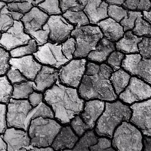
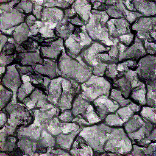
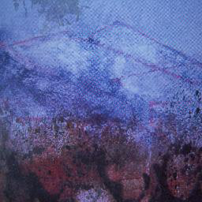
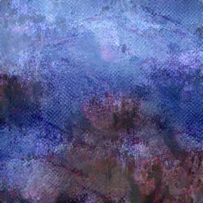
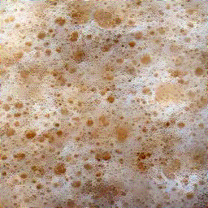
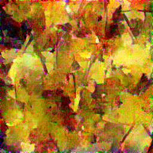

# Texture Synthesis with CNNs and Spectrum Constraints

## Overview

A CNN based approach to generate variations of a texture exemplar by iteratively sampling patches from an example image. We implement this [paper](https://arxiv.org/pdf/1605.01141v3.pdf) by Liu et. al. The task of image synthesis as approached in this paper is a constrained optimization problem.

The architecture uses two VGG19-like networks in conjunction - the first of which is used to produce ideal "feature maps" and the other uses these ideal feature maps to turn a random noise image into an image consisting of features that are similar to the texture exemplar. 
As such, the first network is initialized with pre-trained VGG19 weights and takes in the texture exemplar. 
The feature maps generated from both these networks are tracked. To optimize the white noise image passed to the second network, the model tries to minimize the gap between these two sets of feature maps via a weighted sum of Gram matrix losses computed from each convolution block, and uses the [L-BFGS algorithm](https://en.wikipedia.org/wiki/Limited-memory_BFGS) to synthesize the model’s output. 
**A texture is synthesized during this process of closing the gaps between the "ideal" feature maps from the first network and the "predicted" feature maps from the second network.** 
Furthermore, using Fourier transforms, a spectrum loss is calculated in addition to the Gram loss to further constrain the optimization process and improve synthesis. 


## Dependencies

This project uses PyTorch to build the overall network. All the required dependencies can by installed via the `requirements.txt` file.

```bash
pip install -r requirements.txt
```

## Dataset

Texture exemplars were taken from the [Describable Textures Dataset (DTD)](https://www.robots.ox.ac.uk/~vgg/data/dtd/). You can use the `preprocess_texture_images.py` script to pre-process the dataset. Or, you can use the texture exemplars from the `results` directory to test the model.

## Running the Texture Synthesizer

The Texture Synthesizer model can be imported from `model.py` as `TextureSynthesisCNN`. The model expects a path to a texture exemplar image during initialization. You can use a texture image path to set up the synthesizer model as follows:

```python
synthesizer = TextureSynthesisCNN(tex_exemplar_path="data/cracked_0063.png")
```

_Note: PyTorch will download the weights of the VGG19 model when you initialize the TextureSynthesisCNN class for the first time. This only happens once as PyTorch will cache it._

The synthesizer has an `output_image` attribute which will hold the final sythesized texture. When the model is intialized, the `synthesizer.output_image` attribute intially holds a random noise image. You can use the `synthesizer.synthesize_texture()` to synthesize a variation of the texture exemplar over a specified number of epochs - which essentially tries to move the random noise image closer to an image that consists of features from the texture exemplar.

```python
synthesizer.synthesize_texture(num_epochs=250, display_when_done=True)
```

Once the optimization process occurs for `num_epochs` the `output_image` attribute should now hold a synthesized texture image result. If the synthesized outputs are not satisfactory, you can use `synthesizer.optimize(num_epochs=250)` to continue the optimization for the current synthesis for some more epochs.

_Note: calling `synthesizer.synthesize_texture()` again will reset the `synthesizer.output_image` attribute to a random noise image. This is so that a different variation of the exemplar can be synthesized whenever `synthesize_texture()` is called._

Finally, you can use the `save_textures` method to save a both the exemplar and the synthesized version into a `results` directory (the directory is automatically created if it does not exist). The results will be stored as `results/exemplar_cracked_0063.png` and `results/synth_cracked_0063.png`.

```python
synthesizer.save_textures(display_when_done=True) 
```

## Results

We noted that the texture synthesizer works really well on textures that are filled to the brim with arbitrary patterns (eg. bubbles, cracked surfaces, blotchy images). For others involving a more natural texture (eg. sparse leaves, folds in clothing), the model's loss plateaus at a higher loss value. Among the textures we've teseted, we saw that the loss starts to drop really slowly around 250-300 epochs - hence the loss value at these epochs is a good indicator for the final result being
a good synthesis or not. We found that a loss value below the 1500s range gave good texture synthesis results.

The first image represents the texture exemplar and the second image represents the synthesized texture.

<p float="center">
  
  
  <br />
  <em>Epoch 500, Loss 1514.53</em>
</p>

<p float="left">
  
  
  <br />
  
<em>Epoch 300, Loss 203.703</em>
</p>


<p float="left">
  
  
  <br />
  <em>Epoch 300, Loss 97.055</em>
</p>


<p float="left">
  
  
  <br />
  <em>Epoch 500, Loss 4819.45</em>
</p>
